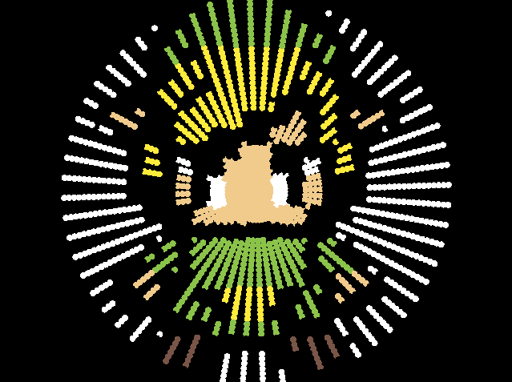

# Rotating Led Display
A rotating led display simulation.
It's like the regular thing but without buying the hardware.
We are cheating by using several rotating arms otherwise raylib refresh rate breaks everything.

## Example

```rust
mod rld;

fn main() {
    let screen_width = 640;
    let screen_height = 480;
    let nb_arms = 60;
    let nb_led = 40;
    let mut disp = rld::Rld::new("assets/link.png", screen_width, screen_height, nb_arms, nb_led);
    disp.start();
}
```
This is the input:


Here is the result:

